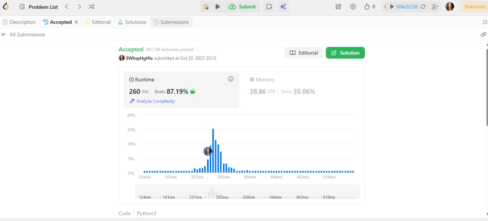
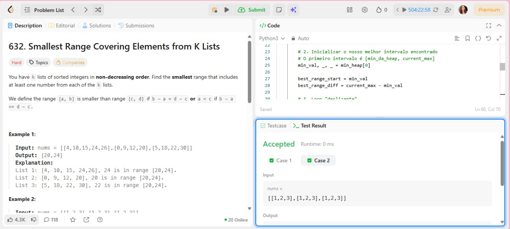

# AlgoritmosAmbiciososDupla15
Repositório destinado ao trabalho de Algoritmos Ambiciosos da disciplina de Projeto de Algoritmos

**Número da Lista**: 15

**Conteúdo da Disciplina**: FGA0124 - PROJETO DE ALGORITMOS - T02  

## Alunos

<table>
  <tr>
    <td align="center"><a href="https://github.com/gabrieladouradof"> <b>Gabriela Dourado</b></a> </td>
    <td align="center"><a href="https://github.com/arthur-suares"> <b>Arthur Suares </b></a> 
  </tr>
</table>

| Matrícula   | Aluno                              |
| ----------- | ---------------------------------- |
| 23/1026821  | Gabriela Dourado França            |
| 21/1062651  | Arthur Miranda Suares              |

---
### Apresentação

[Link da apresentação]()

---
### Screenshots de submissões

[Primeiro Exercício 632. Smallest Range Covering Elements from K Lists](https://leetcode.com/problems/smallest-range-covering-elements-from-k-lists/description/?source=submission-ac)

---

[Segundo exercício (Difícil) - COLOQUE O NOME AQUI](LINK_DO_EXERCICIO_2)

---

[Terceiro exercício (Médio) - COLOQUE O NOME AQUI](LINK_DO_EXERCICIO_3)

---

### Linguagem

Foram utilizadas as linguagens `python 3` e `c++`

---
